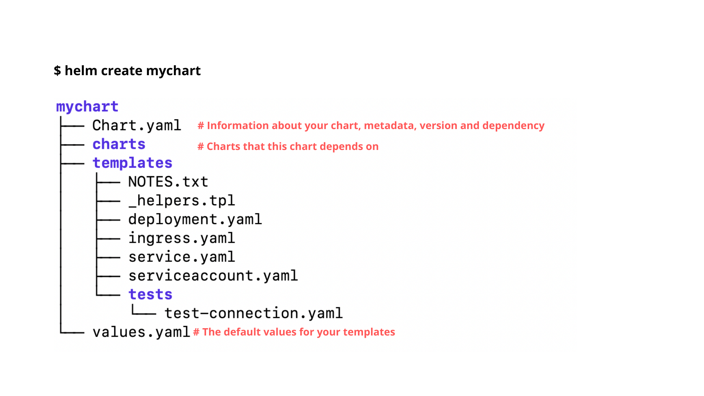
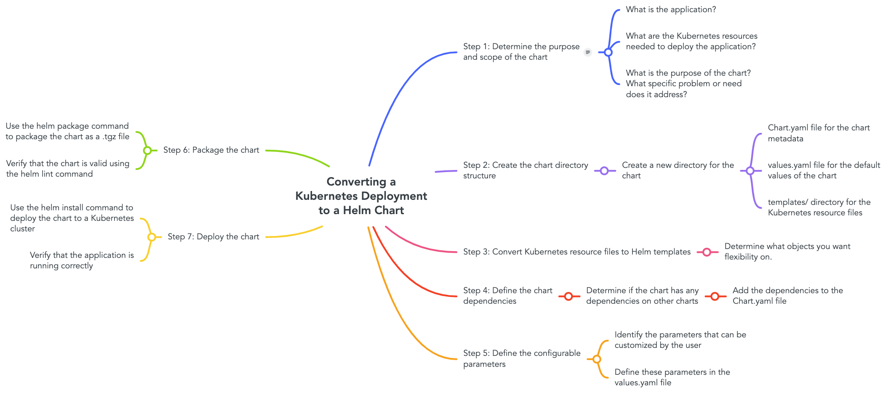

# Requirements
- minikube
- kubectl
- docker
- helm (we'll also go through it in the workshop.)

## Optional
- k9s
- VScode with the following extensions:
  - Kubernetes
  - Kubernetes Support
  - Kubernetes Templates
# Shifting things to helm
## But first what is helm?
Helm is a package manager for Kubernetes that helps automate the deployment, configuration, and management of applications. Helm uses charts to define the structure of the Kubernetes resources that make up an application.

## Helm Chart Anatomy
Helm chart is a collection of files that define the resources needed to run an application on Kubernetes. A Helm chart typically includes the following files:

- Chart.yaml: This file contains metadata about the chart, such as its name, version, and description.
- values.yaml: This file contains configuration values for the chart. These values can be customized by users to configure the application.
- templates/: This directory contains templates for Kubernetes resources, such as Deployments, Services, and ConfigMaps.



## Using Helm Charts
How to use Helm charts to deploy an application to Kubernetes. Here are the steps:

### 1. Install Helm
  - **macOS**: 
  ```
  brew install helm
  
  ```

  - **Linux**: 
  ```
  curl https://baltocdn.com/helm/signing.asc | gpg --dearmor | sudo tee /usr/share/keyrings/helm.gpg > /dev/null

  sudo apt-get install apt-transport-https --yes

  echo "deb [arch=$(dpkg --print-architecture) signed-by=/usr/share/keyrings/helm.gpg] https://baltocdn.com/helm/stable/debian/ all main" | sudo tee /etc/apt/sources.list.d/helm-stable-debian.list

  sudo apt-get update

  sudo apt-get install helm
```

### 2. Add a Helm chart repository 
```
$ helm repo add [NAME] [URL] [flags]
```
For example lets add the grafana repo
```
helm repo add grafana https://grafana.github.io/helm-charts
```
\**As you can see a helm chart is essentially a repository.*
```
helm search repo grafana --output json | jq '.[] | {name: .name, version: .version}'
```

### 3. Search for a chart
```
# Search for stable release versions matching the keyword "nginx"
$ helm search repo nginx

# Search for release versions matching the keyword "nginx", including pre-release versions
$ helm search repo nginx --devel

# Search for the latest stable release for nginx-ingress with a major version of 1
$ helm search repo nginx-ingress --version ^1.0.0
```
### 4. Install the chart
```
$ helm install -f myvalues.yaml myrelease ./mychart

$ helm install --set foo=bar --set foo=newbar  myrelease ./mychart

$ helm install --set-json='foo={"key1":"value1","key2":"value2"}' --set-json='foo.key2="bar"' myrelease ./mychart
```
Let's install a simple chart
```
# Adding a repo
$ helm repo add bitnami https://charts.bitnami.com/bitnami

# Let's see what in this repo
$ helm search repo bitnami

# Make sure we get the latest list of charts
$ helm repo update             
# Installing a mysql
# But before actually installing let's check what this install will do.
$ helm install bitnami/mysql --generate-name --dry-run

# Now, actually installing
$ helm install bitnami/mysql --generate-name

```


### 5. Verify the installation
```
# Using labels to find resources
$ kubectl get all -l app.kubernetes.io/name=mysql
```

### 6. Clean UP
```
$ helm delete bitnami/mysql
# Ops that didn't work
# How do we find the release?

$ kubectl describe <Resource>

# **In the annotation you'll find the release-name

```

## Customizing Helm Charts
How users can customize Helm charts to fit their needs. Here are some examples:

- Modifying values.yaml: modify the values in values.yaml to configure the application.
- Adding new templates: add new templates to the templates/ directory to create new Kubernetes resources.
- Overriding templates: override existing templates in the chart with custom templates.
```
# You can use --set-file to override an existing template.
$ helm upgrade myapp myapp --set-file deployment=myapp/templates/deployment-custom.yaml
# This will override the existing deployment.
```

## Best Practices

- Keep charts small and focused: Each chart should only contain the resources needed for a single type of application.
- Use version control: Store charts in a version control system like Git to track changes over time. It can also be pushed to ECR, this way we can leverage IAM.
- Use semantic versioning: Follow semantic versioning when versioning Helm charts.
- Use chart dependencies: Use dependencies in your charts to manage external dependencies like databases or message queues.

# Our helm chart

Using the stack we've created in the last lesson or the one in kubernetes-04/stack, create a helm chart.

## Step 1: Create a new Helm chart
```
helm create my-app
# his will create a new directory called my-app with a basic Helm chart structure.
```

**Explain what was created by `helm create`.**

## Step 2: Copy the Kubernetes YAML files into the Helm chart
First, clean up templates/ remove all files.

Then copy the Kubernetes YAML files for your application into the templates/ directory of the Helm chart:

```
cp path/to/k8s/*.yaml my-app/templates/
```

## Step 3: Remove any hard-coded values from the YAML files
Now remove any hardcode parameter that you deem important to be flexible.

Using the following syntax: 
```
{{ .Values.<the value that you want> }}
```
Replace all parameters that got removed.

**Here is an example:**

Before making it a template:
```yaml
# templates/deployment.yaml
apiVersion: apps/v1
kind: Deployment
metadata:
  name: my-app
spec:
  template:
    spec:
      containers:
        - name: my-app
          image: php
```
After transforming into a template:
```yaml
# templates/deployment.yaml
apiVersion: apps/v1
kind: Deployment
metadata:
  name: my-app
spec:
  template:
    spec:
      containers:
        - name: my-app
          image: {{ .Values.image }}
```

```perl
# values.yaml
image: php:8.1
```

## Step 4: Update the Helm chart metadata
Edit the Chart.yaml file to update the metadata for the new Helm chart:
```yaml
apiVersion: v2
name: my-app
description: A Helm chart for my-app application
version: 0.1.0
appVersion: 1.0.0
```
## Step 5: Customize the values in the values.yaml file
Update the values.yaml file in the Helm chart directory to set the values for the template variables in your Kubernetes YAML files. For example, you might have a values.yaml file that looks like this:

```yaml
image:
  name: my-registry/my-app
  tag: 1.0.0
```
## Step 6: Verify and package
Verify our chart is OK, run the following:
```perl
helm lint ./myapp
```
That doesn't mean you yaml syntax is alright it only checks templating syntax and very specific thing to helm.
```
# You can also run test on your template passing variables.
helm lint ./myapp -f values.yaml
```

If you also want to check if the output of helm is all good, you must run the following:
```perl
helm template my-app ./myapp|kubeval --strict
```

If everything is OK, let's package it.
```perl
helm package ./myapp
```
That will generate a tgz file that you can push to your registry.

## Step 7: Install the Helm chart
```
helm install my-app ./my-app
```

## How to improve you templates?
- [Template Function List](https://helm.sh/docs/chart_template_guide/function_list/)
- [Template Functions and Pipelines](https://helm.sh/docs/chart_template_guide/functions_and_pipelines/)

\****I strongly recommend using chatGPT and google to build you helm charts.**

# Mind Map when creating a helm chart.
